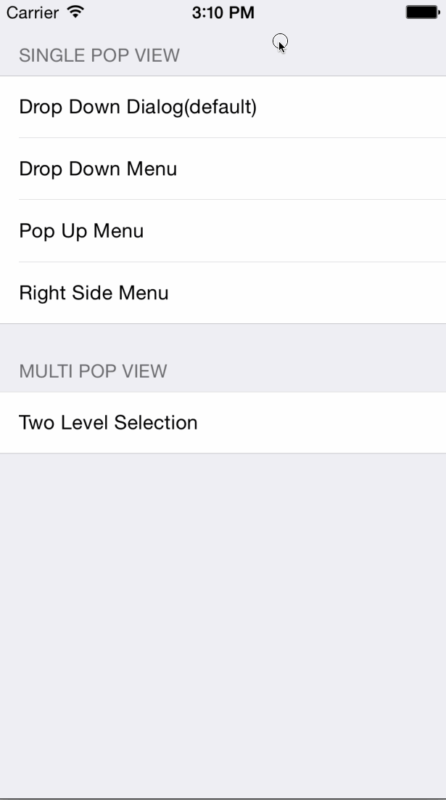
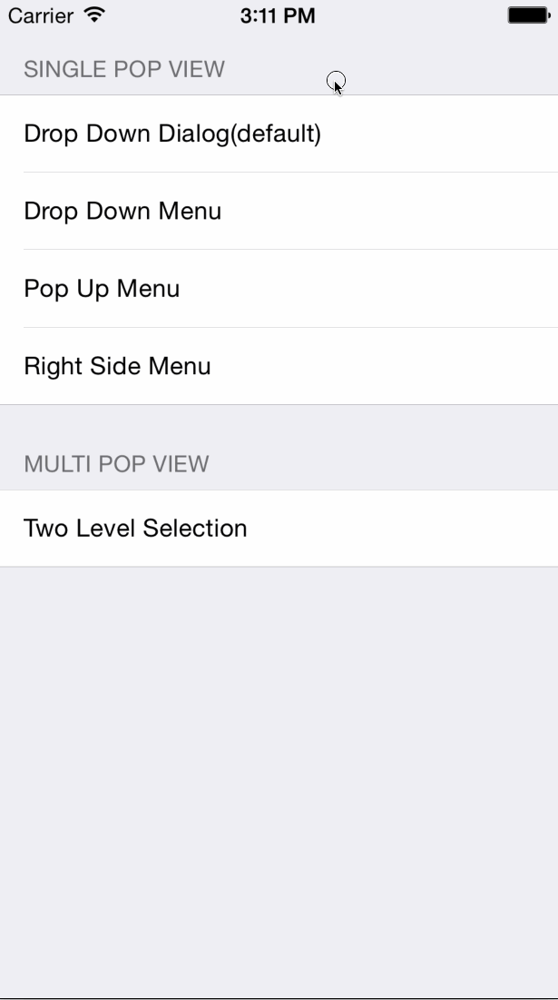

# BUKDynamicPopView

## Introduction

BUKDynamicPopView is a category of UIView. This makes it possible for any view to animate as a dynamic pop view. You can focus on your view, and let BUKDynamicPopView animate the view for you.

It is also possible to custom the animation, while we provide some simple styles for you. With these styles,
you can possibly using BUKDynamicPopView anywhere.

### drop down dialog



### drop down menu



### pop up menu


### right side menu


### two level selection


## Installation

BUKDynamicPopView is available through [CocoaPods](http://cocoapods.org). To install
it, simply add the following line to your Podfile:

```ruby
pod "BUKDynamicPopView"
```
## Usage

After installation, you need to import the header before
use.

```objc
#import <BUKDynamicPopView/BUKDynamicPopView.h>
```

Then, you can simply call `[someView buk_dynamicShowInView:superView];` on any view. BUKDynamicPopView will add the view to the superView and animate for you using default behavior and default style.

**warning**: remember to set view's frame before show.

Also, you can call `[someView buk_dynamicHide];` to hide the view.

### custom animation style

Animation Style is used to control the positions of the dynamic pop view in different states, including before show state, showing state, and after hide state.

Default animation style animates the view from top to center, and then fall out from bottom. But you don't want views always animting in this way.

You can set the `buk_animationStyle` property for custom styles.

```objc
    BUKExamplePopView *view = [[BUKExamplePopView alloc] initWithFrame:CGRectMake(0, 0, kScreenWidth*0.5, kScreenHeight)];    
    
    BUKXOrYMoveAnimationStyle *style = [[BUKXOrYMoveAnimationStyle alloc] initWithView:view];
    style.startPosition = BUKRightOuterBorder;
    style.showPosition = BUKRightInnerBorder;
    style.endPosition = BUKRightOuterBorder;
    
    view.buk_animationStyle = style;
    
    [view buk_dynamicShowInView:nil];
```

If `BUKXOrYMoveAnimationStyle` don't satisfy your needs, you can create your own style which confirms to protocol `<BUKDynamicAnimationStyle>`.

### custom behavior

Behavior is used to control the animation. Default behavior uses UIKit Dynamics's `UIGravityBehavior` and `UICollisionBehavior` for animation.

You can create your own behavior which confirms to protocol `<BUKDynamicBehavior>`, and then assign the behavior to property `buk_dynamicShowBehavior` or `buk_dynamicHideBehavior`.

### more usage

For more details, you can read the comments in the source code.

## Author

hyice, hy_ice719@163.com

## License

BUKDynamicPopView is available under the MIT license. See the LICENSE file for more info.
